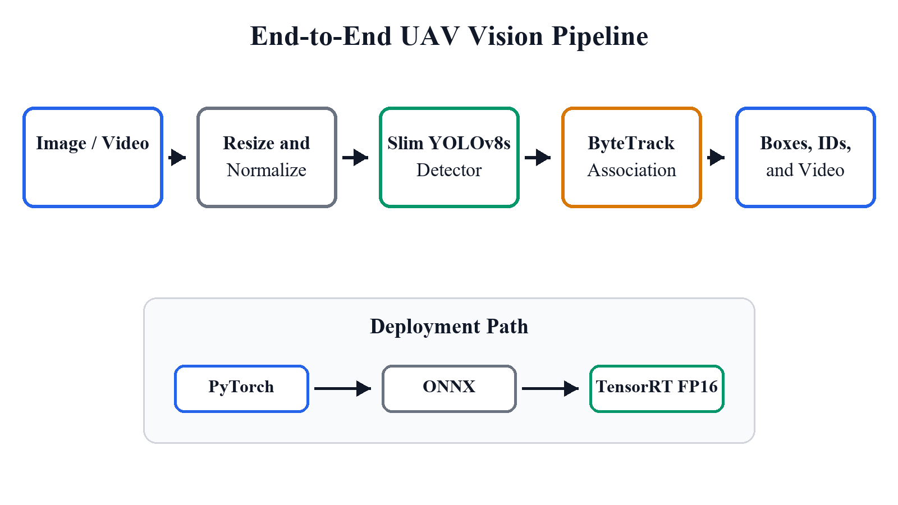
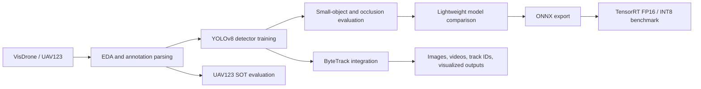
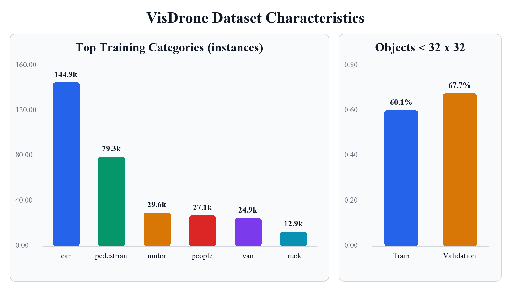
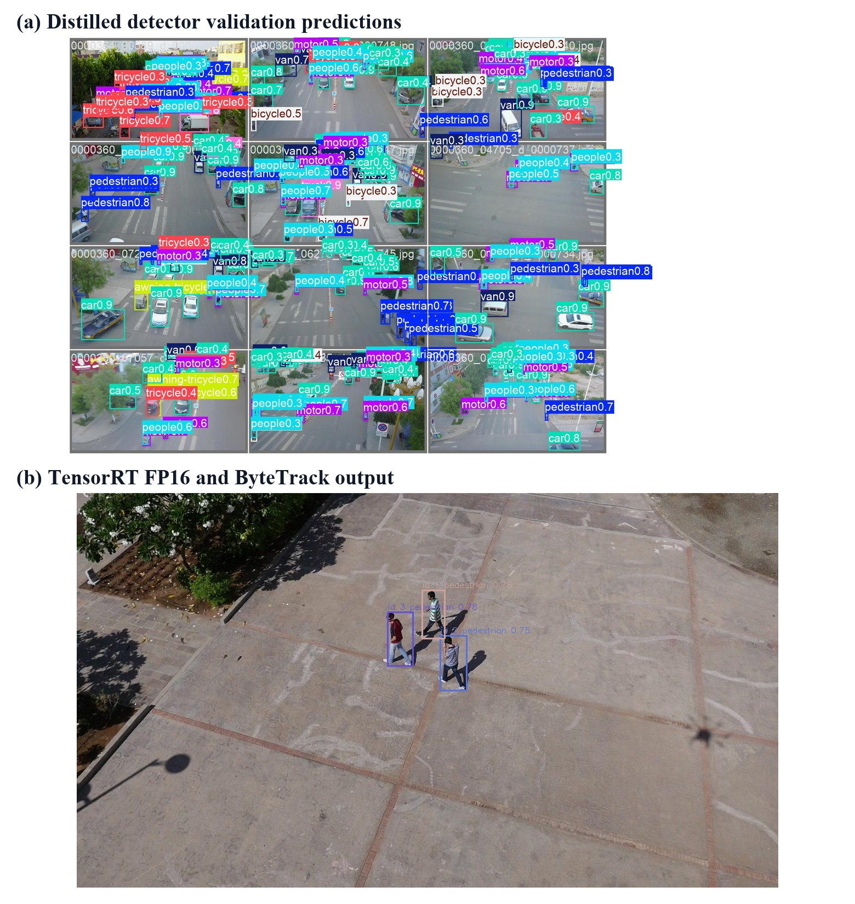
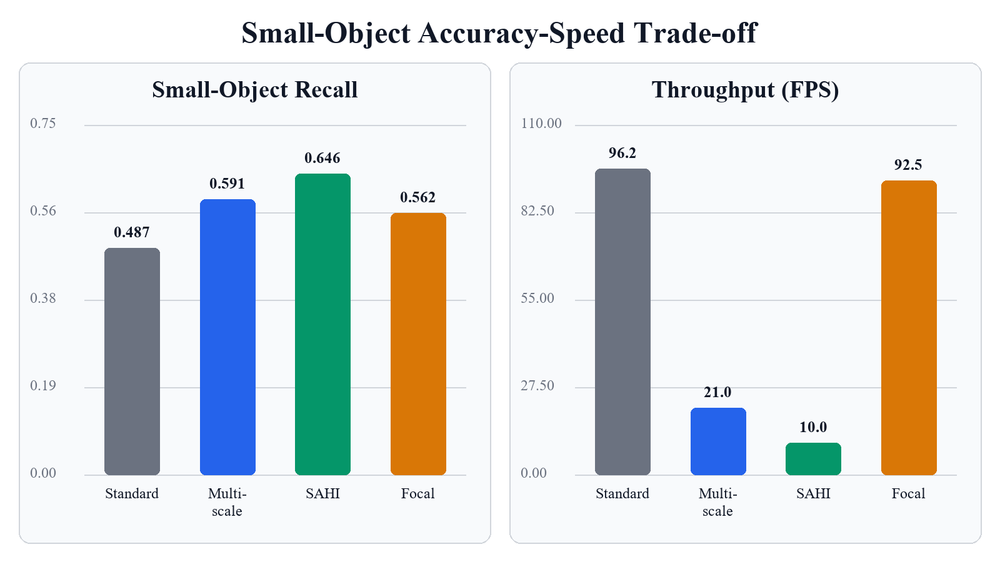
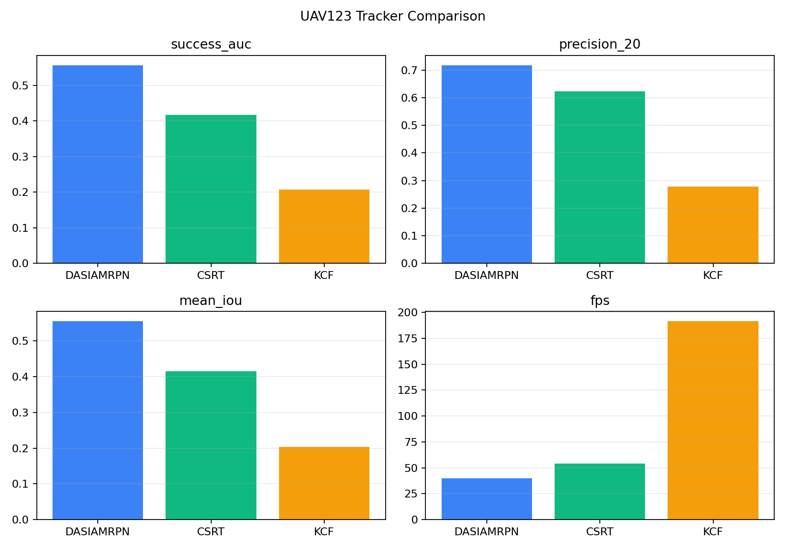
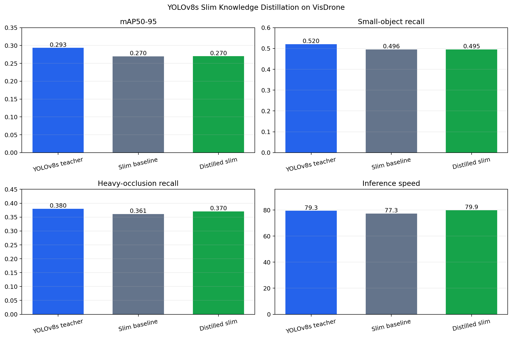
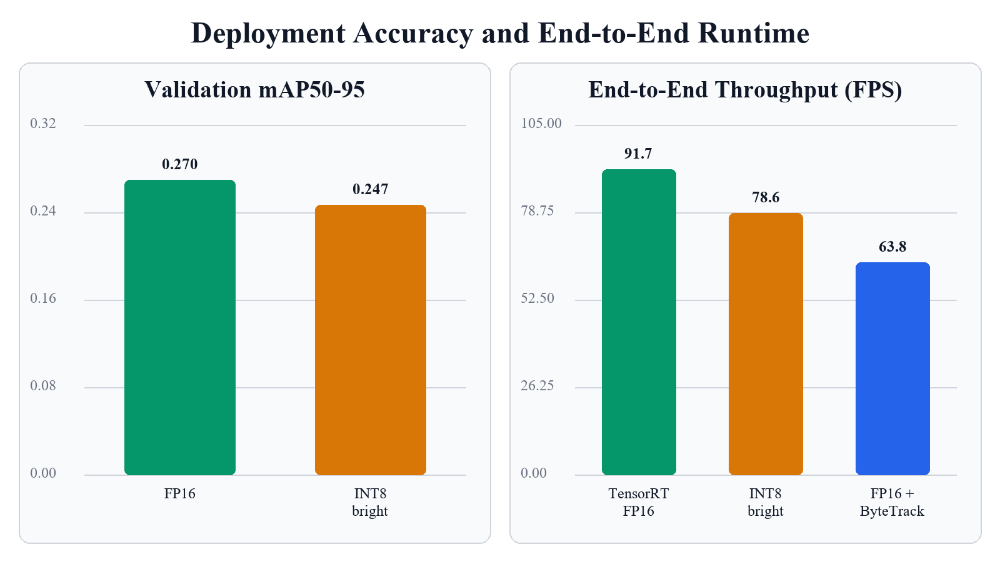
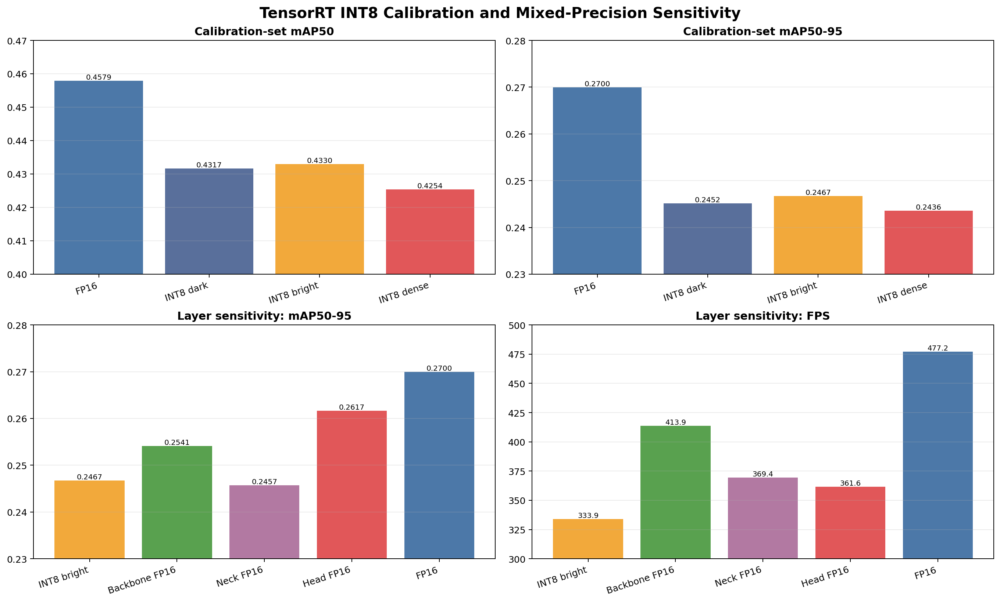

# UAV Vision Project

A reproducible deep learning and computer vision project for UAV imagery. The project covers dataset understanding, object detection, single-object tracking, multi-object tracking, model compression, small-object analysis, ONNX export, TensorRT deployment, and end-to-end demo inference.



## Highlights

- **Datasets:** VisDrone for aerial object detection and UAV123 for UAV target tracking.
- **Detection:** YOLOv8-based training, evaluation, lightweight slimming, MobileNet-FPN comparison, and small-object ablations.
- **Tracking:** KCF, CSRT, DaSiamRPN single-object tracking and YOLO + ByteTrack multi-object tracking.
- **Optimization:** data augmentation, conservative width scaling, SAHI slicing, multi-scale inference, focal loss, resampling, pruning-oriented slimming, and teacher-student distillation.
- **Deployment:** ONNX export, ONNXRuntime CUDA validation, TensorRT FP16 / INT8 engine benchmarking, and integrated detection-plus-tracking runtime tests.
- **Deliverables:** reproducible scripts, experiment assets, visualizations, technical notes, and an IEEE-style final paper.

## Repository Layout

```text
.
|-- configs/              # Dataset and model configuration files
|-- data/                 # Local dataset mount point; large raw data is ignored
|-- docs/                 # Technical notes, paper, tables, and visualization assets
|-- models/               # Local checkpoints and exported models; large files are ignored
|-- outputs/              # Local experiment outputs; ignored by git
|-- scripts/              # Command-line workflows for training, evaluation, export, and demos
`-- src/uav_vision/       # Core Python package for data parsing, tracking, and distillation utilities
```

## End-to-End Workflow



## Dataset Understanding

The project analyzes aerial scene characteristics that directly affect UAV perception: class imbalance, dense objects, small bounding boxes, camera motion, and occlusion.



| Dataset | Role | Main Use |
| --- | --- | --- |
| VisDrone | Aerial object detection | Training, validation, small-object analysis, occlusion analysis |
| UAV123 | UAV tracking benchmark | Single-object tracking evaluation and multi-object demo inputs |

Related notes:

- [Environment and data](docs/phase1_environment_and_data.md)
- [Dataset structure and annotations](docs/dataset_structure_and_annotations.md)

## Detection Models

YOLOv8s is used as the accuracy-oriented baseline. YOLOv8n and slim YOLOv8s variants are evaluated as lightweight candidates. A MobileNetV3-FPN path is also tested to compare an alternative lightweight backbone strategy.

| Model | mAP50-95 | Small Recall | Heavy-Occlusion Recall | FPS |
| --- | ---: | ---: | ---: | ---: |
| YOLOv8s teacher | 0.2933 | 0.5201 | 0.3796 | 79.3 |
| Slim YOLOv8s 0.4375 | 0.2696 | 0.4955 | 0.3611 | 77.3 |
| Distilled slim YOLOv8s | 0.2699 | 0.4953 | 0.3702 | 79.9 |
| MobileNetV3-FPN baseline | 0.1033 | 0.2205 | 0.1909 | 78.1 |
| MobileNetV3-FPN balanced | 0.0996 | 0.2426 | 0.2239 | 73.4 |



Related notes:

- [Detection training](docs/phase2_detection_training.md)
- [Detection evaluation](docs/phase2_model_evaluation.md)
- [Lightweight model comparison](docs/phase4_lightweight_model_comparison.md)
- [MobileNet aerial balanced experiment](docs/phase4_mobilenet_aerial_balanced.md)

## Small-Object Analysis

Small objects are a primary limitation in aerial detection. The project compares standard inference, multi-scale inference, SAHI slicing, focal loss, and image-level resampling using measured outputs.



| Method | Small Recall | mAP50 | mAP50-95 | FPS | Takeaway |
| --- | ---: | ---: | ---: | ---: | --- |
| Standard slim | 0.4868 | 0.4350 | 0.2444 | 96.2 | Real-time baseline |
| Multi-scale 768/960/1280 | 0.5907 | 0.4786 | 0.2766 | 21.0 | Strong accuracy gain, slower |
| SAHI 640 overlap 0.20 | 0.6456 | 0.4888 | 0.2723 | 10.0 | Best small-object recall, offline mode |
| Focal gamma 2 | 0.5615 | 0.4304 | 0.2435 | 92.5 | Recall gain with limited AP improvement |
| Small-object resampling | 0.4861 | 0.4300 | 0.2410 | 98.3 | No useful gain |

Related notes:

- [Small-object ablation](docs/phase4_yolo_small_object_ablation.md)
- [MobileNet small-object ablation](docs/phase4_mobilenet_small_object_ablation.md)

## Tracking

The project evaluates classical and Siamese single-object trackers on UAV123, then integrates YOLOv8s-slim detection with ByteTrack for multi-object tracking visualization.



| Tracker | Success AUC | Precision@20 | Mean IoU | FPS |
| --- | ---: | ---: | ---: | ---: |
| DaSiamRPN | 0.556 | 0.718 | 0.555 | 39.9 |
| CSRT | 0.417 | 0.624 | 0.416 | 54.0 |
| KCF | 0.207 | 0.279 | 0.204 | 191.4 |

The final detection-plus-tracking demo processes image, video, and frame-directory inputs and outputs bounding boxes, track IDs, annotated frames, and videos.

Related note:

- [Tracking baseline](docs/phase3_tracking_baseline.md)

## Distillation

A full YOLOv8s teacher supervises the slim YOLOv8s student through output-distribution distillation. The experiment shows a small heavy-occlusion recall gain while preserving the compact student architecture.



| Model | mAP50-95 | Small Recall | Heavy-Occlusion Recall |
| --- | ---: | ---: | ---: |
| YOLOv8s teacher | 0.2933 | 0.5201 | 0.3796 |
| Slim baseline | 0.2696 | 0.4955 | 0.3611 |
| Distilled slim | 0.2699 | 0.4953 | 0.3702 |

Related note:

- [YOLO distillation](docs/phase4_yolo_distillation.md)

## Deployment and Runtime Benchmarking

Models are exported to ONNX, validated with ONNXRuntime CUDA, and benchmarked with TensorRT FP16 / INT8 engines. On the evaluated GPU, TensorRT FP16 is the most stable deployment path among the tested options.



| Runtime Path | Precision | Mode | FPS | Peak RAM MiB | Notes |
| --- | --- | --- | ---: | ---: | --- |
| Full YOLOv8s PyTorch | FP32 | Detect | 77.2 | 1480.1 | Accuracy reference |
| Slim YOLOv8s PyTorch | FP32 | Detect | 78.1 | 1444.6 | Compact checkpoint |
| Slim YOLOv8s PyTorch | FP16 | Detect | 86.1 | 1750.3 | Faster but higher process RAM |
| Slim YOLOv8s ONNXRuntime | FP16 | Detect | 60.3 | 2048.9 | Portable ONNX path |
| Slim YOLOv8s TensorRT | FP16 | Detect | 91.7 | 1175.9 | Final deployment choice |
| Slim YOLOv8s TensorRT | INT8 | Detect | 78.6 | 1192.5 | Slower and less accurate here |
| TensorRT FP16 + ByteTrack | FP16 | Track | 63.8 | 1215.0 | Integrated pipeline |

INT8 scene-specific calibration was tested on bright, dark, and dense calibration sets. The bright set gave the best INT8 result, but all tested INT8 engines remained below FP16 in both accuracy and raw engine throughput.

| Engine | mAP50-95 | Raw Engine FPS |
| --- | ---: | ---: |
| TensorRT FP16 | 0.2700 | 477.2 |
| INT8 dark calibration | 0.2452 | 337.6 |
| INT8 bright calibration | 0.2467 | 333.9 |
| INT8 dense calibration | 0.2436 | 336.1 |



Related notes:

- [ONNX export](docs/phase4_onnx_export.md)
- [TensorRT INT8 benchmark](docs/phase4_tensorrt_int8_benchmark.md)
- [INT8 scene calibration](docs/phase4_int8_scene_calibration.md)
- [Runtime memory benchmark](docs/phase4_runtime_memory_benchmark.md)

## Quick Start

### 1. Create Environment

```powershell
conda activate D:\Anaconda3\envs\ml-gpu
pip install -r requirements.txt
```

### 2. Check Environment

```powershell
python scripts/check_environment.py
```

### 3. Prepare Data

```powershell
python scripts/prepare_visdrone_yolo.py --help
python scripts/prepare_uav123_frames.py --help
```

Large datasets are expected under `data/` and are ignored by git.

### 4. Train or Evaluate a Detector

```powershell
python scripts/train_detector.py --help
python scripts/evaluate_detector.py --help
```

### 5. Export and Benchmark

```powershell
python scripts/export_onnx.py --help
python scripts/benchmark_onnxruntime.py --help
python scripts/benchmark_runtime_memory.py --help
```

### 6. Run the Integrated Pipeline

```powershell
python scripts/run_pipeline.py --help
```

The pipeline supports image, video, and frame-directory inputs, and can produce detection boxes, track IDs, annotated frames, and videos.

## Key Scripts

| Script | Purpose |
| --- | --- |
| `scripts/analyze_datasets.py` | Dataset EDA and annotation statistics |
| `scripts/prepare_visdrone_yolo.py` | Convert VisDrone annotations to YOLO format |
| `scripts/prepare_uav123_frames.py` | Prepare UAV123 frame manifests |
| `scripts/train_detector.py` | Train YOLO detectors and slim variants |
| `scripts/evaluate_detector.py` | Evaluate detection metrics, small objects, and occlusion groups |
| `scripts/evaluate_single_object_trackers.py` | Evaluate KCF, CSRT, and DaSiamRPN on UAV123 |
| `scripts/export_onnx.py` | Export PyTorch checkpoints to ONNX and verify outputs |
| `scripts/benchmark_onnxruntime.py` | Benchmark ONNXRuntime providers |
| `scripts/benchmark_runtime_memory.py` | Measure latency, FPS, RAM, and GPU memory behavior |
| `scripts/run_pipeline.py` | Run detection or detection-plus-tracking demos |
| `scripts/reports/build_ieee_paper.py` | Rebuild the final IEEE-style technical paper |

## Documentation

- [Project overview](docs/project_overview.md)
- [Phase 1: environment and data](docs/phase1_environment_and_data.md)
- [Phase 2: detection training](docs/phase2_detection_training.md)
- [Phase 3: tracking](docs/phase3_tracking_baseline.md)
- [Phase 4: ONNX export](docs/phase4_onnx_export.md)
- [Phase 4: lightweight comparison](docs/phase4_lightweight_model_comparison.md)
- [Phase 4: pruning experiment](docs/phase4_pruning_experiment.md)
- [Phase 4: TensorRT and INT8](docs/phase4_tensorrt_int8_benchmark.md)
- [Phase 4: distillation](docs/phase4_yolo_distillation.md)
- [Final paper](docs/paper/uav_vision_ieee_paper.pdf)

## Notes on Large Artifacts

The repository intentionally keeps large local artifacts out of version control:

- raw datasets under `data/raw/`
- processed datasets under `data/processed/`
- checkpoints under `models/checkpoints/`
- exported engines under `models/exported/`
- local experiment outputs under `outputs/`
- training runs under `runs/`

Small curated figures and CSV summaries used by the documentation are tracked under `docs/assets/` and `docs/paper/assets/`.

## Final Deliverable

The final paper summarizes the full measured workflow, including detection, tracking, small-object ablation, model compression, distillation, ONNX/TensorRT deployment, and integrated demo results.

- [IEEE-style paper DOCX](docs/paper/uav_vision_ieee_paper.docx)
- [IEEE-style paper PDF](docs/paper/uav_vision_ieee_paper.pdf)
