# TensorRT INT8 Scene Calibration and Layer Sensitivity

## Objective

This follow-up experiment tests whether a scene-specific INT8 calibration set can reduce the accuracy loss observed in the original TensorRT INT8 export. It also identifies which model region is most sensitive to quantization by restoring the backbone, neck, or detection head to FP16 while keeping the remaining quantizable nodes in INT8.

Every metric in this report comes from a completed local run. The same 548-image VisDrone validation split was used for all engine comparisons.

## Environment

| Item | Value |
| --- | --- |
| Model | YOLOv8s-slim 0.4375 e100 |
| GPU | NVIDIA GeForce RTX 5080 Laptop GPU |
| TensorRT | 11.1.0.106 |
| Ultralytics | 8.4.75 |
| Input | 960 x 960, batch 1 |
| Calibration method | ModelOpt max calibration, explicit Q/DQ |
| Calibration images | 320 per scene |
| Validation images | 548 |
| Validation objects | 38,759 |

## Calibration Sets

The calibration images were selected from the 6,471-image VisDrone training split. Bright and dark sets were selected by mean grayscale value. The dense set was selected by the number of valid annotated objects.

| Set | Images | Mean brightness | Brightness range | Mean objects | Object range |
| --- | ---: | ---: | ---: | ---: | ---: |
| Dark | 320 | 21.84 | 2.08-28.86 | 26.33 | 4-123 |
| Bright | 320 | 158.17 | 139.83-222.63 | 54.69 | 1-236 |
| Dense | 320 | 107.42 | 34.93-175.78 | 183.46 | 133-902 |

Dark and bright had no shared images. Dark and dense also had no overlap. Bright and dense shared 20 images.

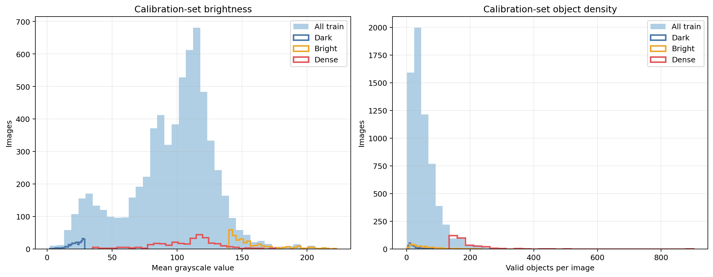

### Real calibration samples

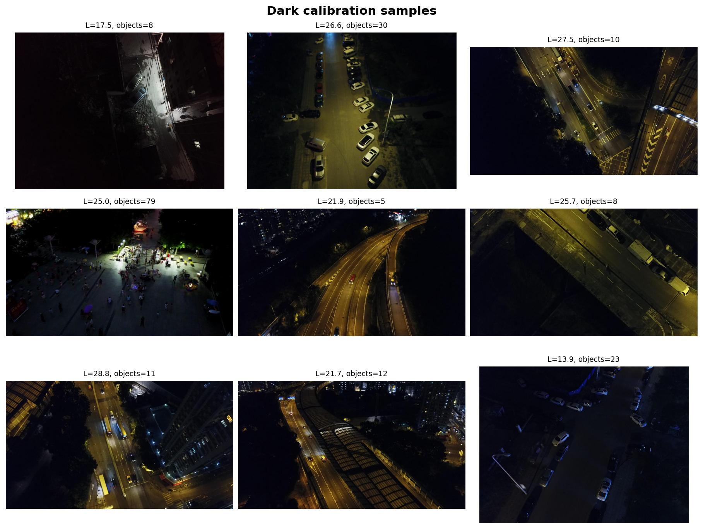

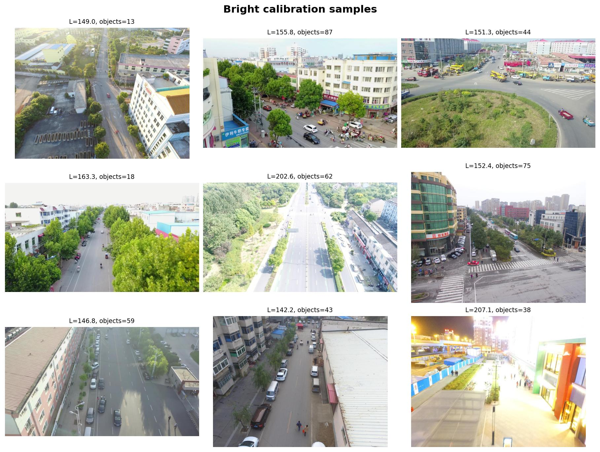

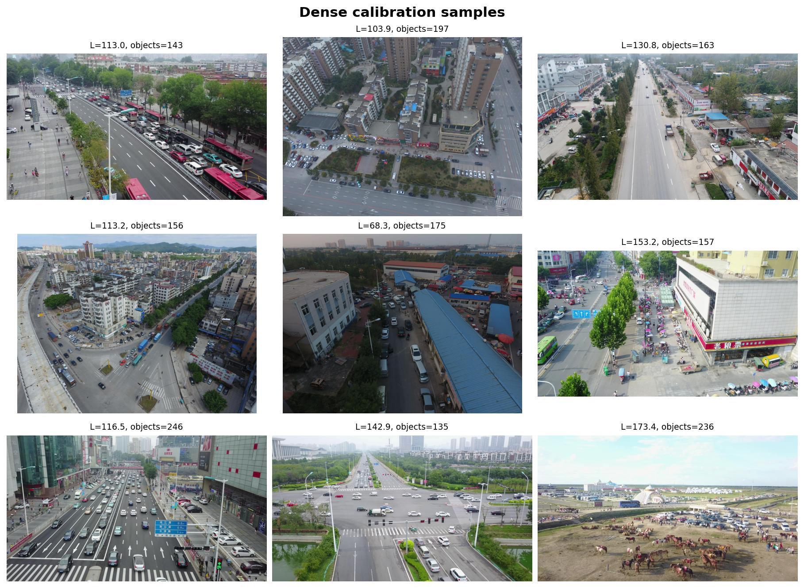

## Scene Calibration Results

| Engine | Precision | Recall | mAP50 | mAP50-95 | Inference | FPS | Size |
| --- | ---: | ---: | ---: | ---: | ---: | ---: | ---: |
| TensorRT FP16 | **0.56059** | **0.46590** | **0.45794** | **0.26999** | **2.10 ms** | **477.19** | **21.69 MB** |
| INT8 dark | 0.53834 | 0.43951 | 0.43167 | 0.24516 | 2.96 ms | 337.61 | 65.92 MB |
| INT8 bright | 0.54078 | 0.44207 | 0.43296 | 0.24670 | 3.00 ms | 333.89 | 66.02 MB |
| INT8 dense | 0.53918 | 0.43405 | 0.42539 | 0.24360 | 2.98 ms | 336.12 | 65.98 MB |

Bright calibration was the most accurate INT8 configuration. Relative to FP16, it lost 0.01981 precision, 0.02383 recall, 0.02498 mAP50, and 0.02329 mAP50-95. Dense calibration was the weakest configuration and lost 0.03255 mAP50.

Calibration distribution had a measurable effect, but it did not remove the INT8 accuracy gap. The three INT8 engines also remained slower than FP16 in this TensorRT 11 explicit-Q/DQ implementation.

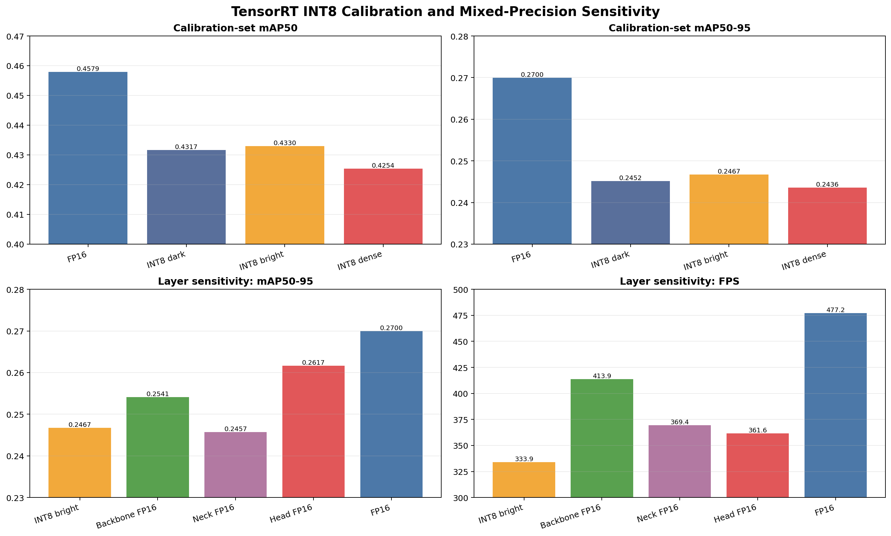

### Prediction comparison

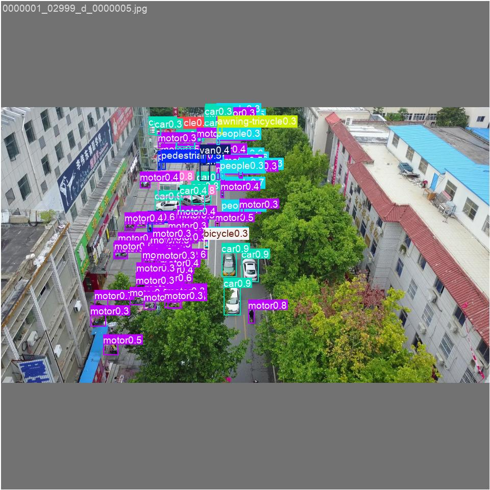

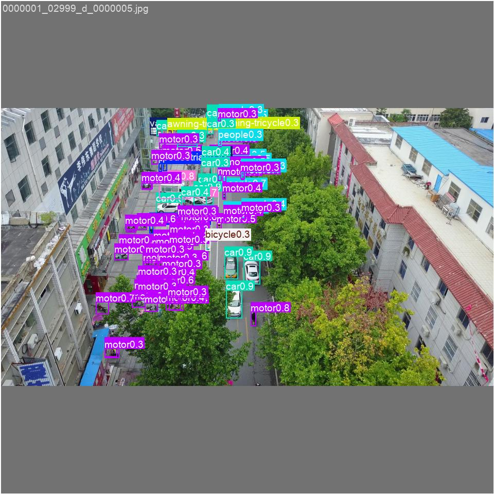

## Layer Sensitivity

The bright calibration set was fixed for every sensitivity run. One logical model region was excluded from INT8 quantization and retained in FP16:

- backbone: ONNX layers `/model.0/` through `/model.9/`;
- neck: ONNX layers `/model.10/` through `/model.21/`;
- detection head: ONNX layer `/model.22/`.

| Configuration | Precision | Recall | mAP50 | mAP50-95 | FPS |
| --- | ---: | ---: | ---: | ---: | ---: |
| Full INT8 bright | 0.54078 | 0.44207 | 0.43296 | 0.24670 | 333.89 |
| Backbone FP16 | 0.54535 | **0.45637** | 0.44418 | 0.25412 | **413.85** |
| Neck FP16 | 0.54427 | 0.44114 | 0.43160 | 0.24575 | 369.37 |
| Detection head FP16 | **0.55682** | 0.44958 | **0.44454** | **0.26168** | 361.59 |
| Full FP16 | 0.56059 | 0.46590 | 0.45794 | 0.26999 | 477.19 |

The detection head was the most sensitive region for localization accuracy. Restoring `/model.22/` to FP16 recovered 46% of the mAP50 gap and 64% of the mAP50-95 gap between full INT8 and FP16. This group contains 19 convolution nodes plus the classification, box-regression, DFL, sigmoid, reshape, and decode path.

The backbone was also sensitive. Restoring it to FP16 recovered 45% of the mAP50 gap, 32% of the mAP50-95 gap, and most of the recall loss. Restoring the neck did not improve the full INT8 result, so the neck is not the primary source of degradation under this calibration method.

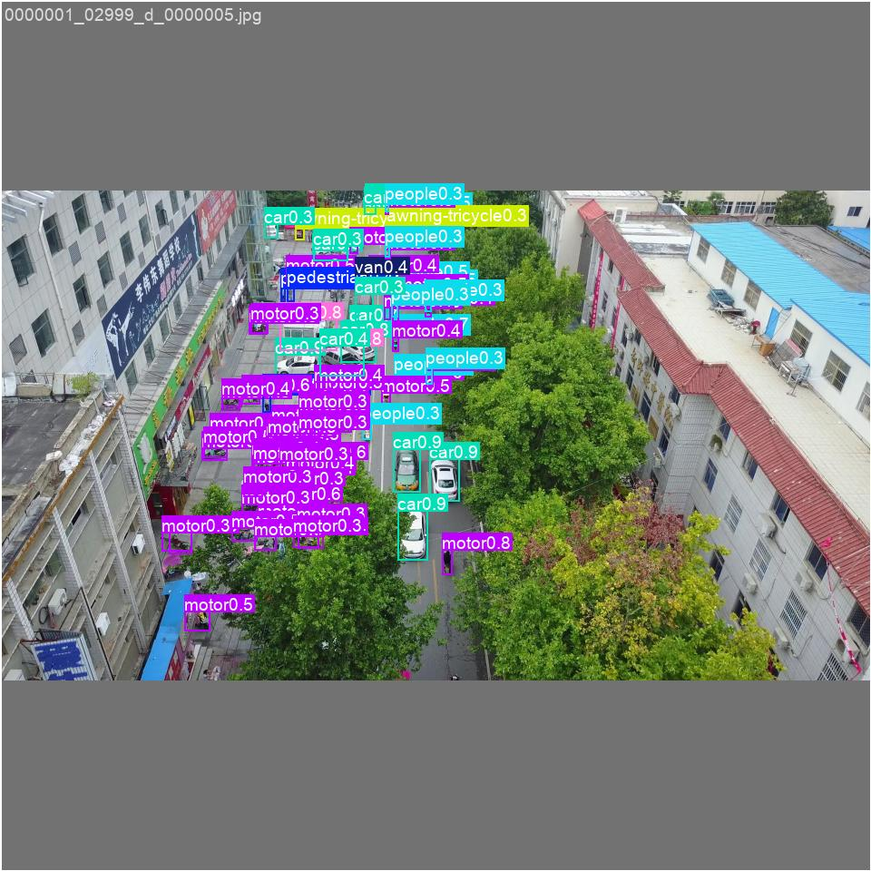

### PR curves

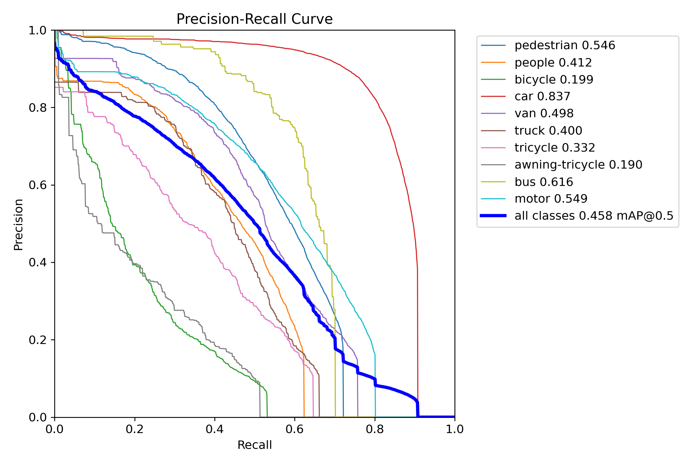

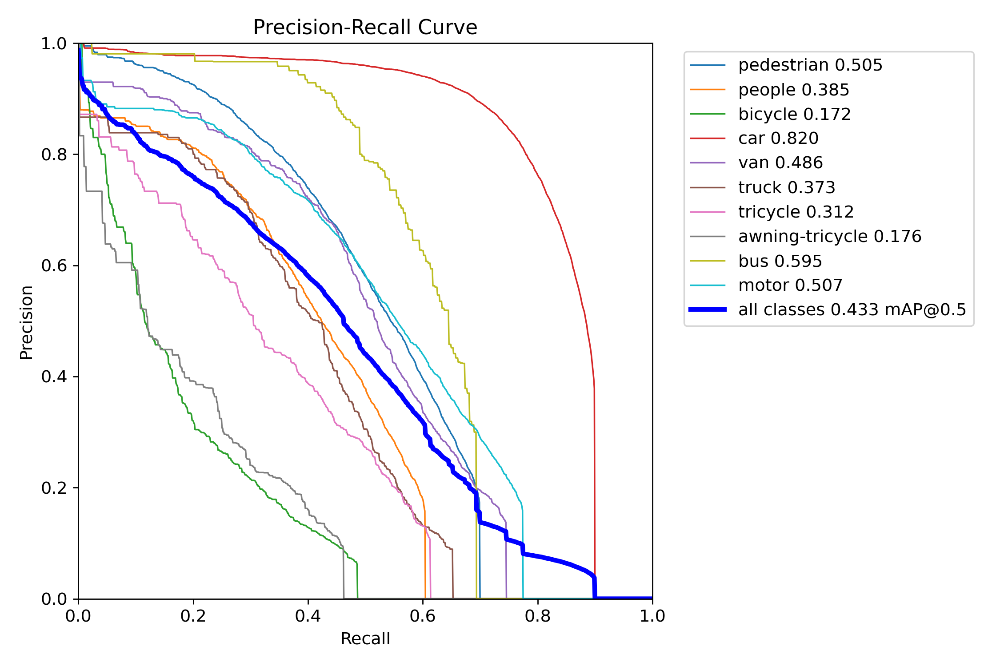

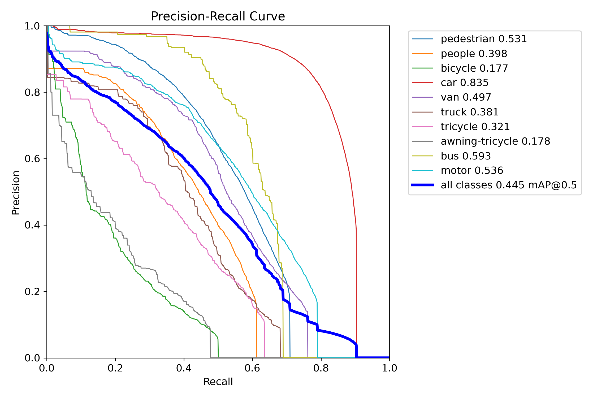

## Deployment Decision

TensorRT FP16 remains the deployment recommendation for this GPU and model.

- It has the highest precision, recall, mAP50, and mAP50-95.
- It is faster than every tested INT8 and mixed-precision engine in the unified validation run.
- Its serialized engine is substantially smaller than the full INT8 engines.
- Scene-specific calibration changes accuracy but does not eliminate the INT8 loss.

The detection-head FP16 hybrid is the best mixed-precision research variant, but it is still 0.01340 below FP16 in mAP50, 0.00831 below FP16 in mAP50-95, and approximately 24% slower. It is therefore not selected for deployment.

## Reproduction

Prepare the calibration sets:

```powershell
D:\Anaconda3\envs\ml-gpu\python.exe scripts\experiments\prepare_int8_calibration_sets.py --samples 320
```

Build a scene-calibrated engine:

```powershell
D:\Anaconda3\envs\ml-gpu\python.exe scripts\experiments\build_scene_int8_engines.py --scene bright
```

Evaluate an engine:

```powershell
D:\Anaconda3\envs\ml-gpu\python.exe scripts\experiments\evaluate_tensorrt_engine.py --engine models\exported\yolov8s_slim04375_visdrone_e100_int8_bright.engine --name int8_bright
```

Build a mixed-precision sensitivity engine:

```powershell
D:\Anaconda3\envs\ml-gpu\python.exe scripts\experiments\build_mixed_precision_sensitivity.py --group head
```

Generate the final CSV files and chart:

```powershell
D:\Anaconda3\envs\ml-gpu\python.exe scripts\experiments\summarize_int8_calibration.py
```

Machine-readable results are available in [calibration_results.csv](assets/int8_scene_calibration/calibration_results.csv) and [sensitivity_results.csv](assets/int8_scene_calibration/sensitivity_results.csv).
