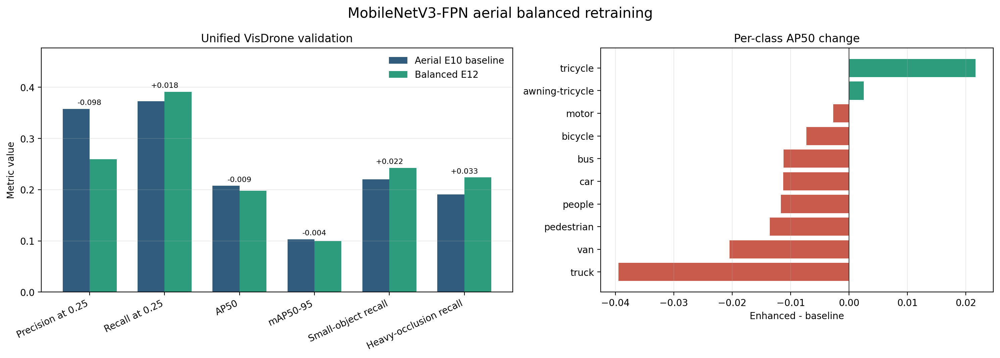
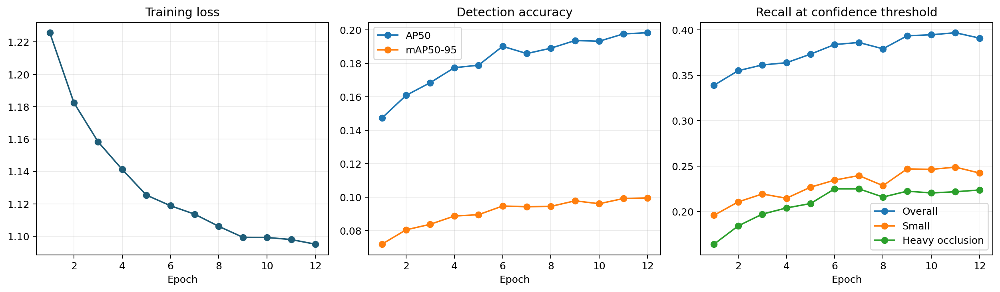
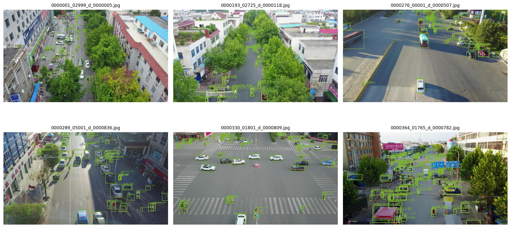

# MobileNetV3-FPN Aerial Balanced Retraining

## Objective

This experiment extends the previous MobileNetV3-FPN VisDrone study with a stricter, unified validation protocol and a second-stage aerial-domain fine-tuning run. Every reported value was produced by the local training and validation pipeline.

The experiment tests three hypotheses:

1. A VisDrone-trained MobileNetV3-FPN checkpoint is a better aerial-domain initialization than restarting from generic COCO weights.
2. Effective-number class weighting and focal classification loss can reduce the impact of class imbalance.
3. Smaller anchors and area-weighted box regression can improve recall for dense small targets.

## Initialization

No drop-in compatible public checkpoint was identified during the source review for for the exact Torchvision Faster R-CNN MobileNetV3-Large FPN architecture and the 10 VisDrone classes. Checkpoints built for ResNet Faster R-CNN, YOLO, RetinaNet, or a different MobileNet detection head are not shape-compatible and would not provide a controlled initialization comparison.

The run therefore uses the existing VisDrone-trained checkpoint as an aerial-domain pretrained model:

`outputs/training/mobilenet_fpn_visdrone_e10_full/weights/best.pt`

This checkpoint was originally initialized from Torchvision COCO detector weights and then fine-tuned on VisDrone. The new run loads model weights only and starts a fresh optimizer and learning-rate schedule.

## Training Configuration

| Setting | Value |
|---|---:|
| Training images | 6,471 |
| Validation images | 548 |
| Epochs | 12 |
| Input resize | 800-1,280 px |
| Batch size | 2 |
| Initial learning rate | 0.0005 |
| Optimizer | SGD |
| Weight decay | 0.0005 |
| Focal gamma | 2.0 |
| Small-object area threshold | 1,024 px^2 |
| Small-object regression weight | 2.0 |
| Checkpoint selection | mAP50-95 |

### Class-balanced focal loss

Foreground class weights are computed with the effective-number formulation using beta 0.9999 and normalized to mean one. The largest weights were assigned to underrepresented aerial categories: awning-tricycle 2.1733, tricycle 1.5772, and bus 1.3473. The ROI classification loss uses these weights together with multi-class focal modulation.

### Small-object localization

Positive ROI samples matched to a transformed ground-truth box below 32 x 32 pixels receive twice the Smooth L1 box-regression weight. The RPN anchor sets are shifted toward small targets:

- Feature level 1: 8, 16, 32, 64, 128
- Feature level 2: 16, 32, 64, 128, 256
- Feature level 3: 32, 64, 128, 256, 512

The number of anchors per location remains unchanged, so the aerial checkpoint remains structurally compatible.

## Unified Validation Protocol

The baseline and enhanced models were both re-evaluated at 800-1,280 pixel input resolution with the same 548 VisDrone validation images, confidence threshold 0.25, IoU matching threshold 0.50, maximum 300 detections per image, and AP predictions retained from score 0.01.

AP uses score-ordered one-to-one matching and 101-point interpolation. `mAP50-95` averages class AP over IoU thresholds from 0.50 to 0.95 in steps of 0.05. The values are produced by the project evaluator and are directly comparable within this experiment; they are not presented as official VisDrone challenge-server scores.

## Results

| Metric | Aerial E10 baseline | Balanced E12 | Absolute change | Relative change |
|---|---:|---:|---:|---:|
| Precision at 0.25 | 0.35764 | 0.25937 | -0.09827 | -27.48% |
| Recall at 0.25 | 0.37287 | 0.39103 | +0.01816 | +4.87% |
| AP50 | 0.20758 | 0.19823 | -0.00935 | -4.50% |
| mAP50-95 | 0.10335 | 0.09958 | -0.00376 | -3.64% |
| Small-object recall | 0.22051 | 0.24256 | +0.02205 | +10.00% |
| Heavy-occlusion recall | 0.19086 | 0.22391 | +0.03305 | +17.32% |
| FPS | 78.11 | 73.43 | -4.68 | -5.99% |



The best enhanced checkpoint was produced at epoch 12. Training loss fell from 1.22574 to 1.09506. The enhanced model recovered more small and heavily occluded objects, but it also produced more false positives and slightly lower localization AP.



### Per-class AP50 changes

Class balancing improved tricycle AP50 by 0.02166 and awning-tricycle AP50 by 0.00251. Other categories declined, with the largest drops for truck (-0.03950) and van (-0.02044). This indicates that the chosen weighting and focal strength over-corrected the decision boundary instead of producing a uniform class-level gain.



## Interpretation

The experiment is a successful recall-oriented variant, not a universal replacement for the baseline:

- Use the aerial E10 baseline when precision, AP, and throughput are the primary constraints.
- Use the balanced E12 checkpoint when missing small or heavily occluded targets is more costly than extra false positives.
- The 10% small-target recall gain and 17.32% heavy-occlusion recall gain validate the small-object direction.
- The 3.64% mAP50-95 loss shows that the combination of gamma 2.0 focal loss, 2.0 small-box weighting, and shifted anchors is too aggressive for a precision-balanced deployment model.

A follow-up precision-recovery ablation should keep aerial initialization and 800-1,280 inputs while reducing focal gamma to 1.0-1.5, reducing the small-box weight to 1.5, and comparing default anchors against the shifted anchor set independently.

## Reproduction

```powershell
D:\Anaconda3\envs\ml-gpu\python.exe scripts\experiments\train_mobilenet_fpn.py `
  --output outputs\training\mobilenet_fpn_visdrone_aerial_balanced_e12 `
  --epochs 12 --batch-size 2 --workers 4 `
  --lr 0.0005 --weight-decay 0.0005 `
  --min-size 800 --max-size 1280 `
  --init-checkpoint outputs\training\mobilenet_fpn_visdrone_e10_full\weights\best.pt `
  --pretraining-source visdrone_aerial_e10_best `
  --enhanced-loss --small-anchors `
  --class-balance-beta 0.9999 --max-class-weight 4.0 `
  --focal-gamma 2.0 --small-object-weight 2.0 `
  --detections-per-image 300 --eval-score-threshold 0.01 `
  --selection-metric map50_95
```

## Artifacts

- Baseline complete validation: `outputs/evaluation/mobilenet_fpn_aerial_e10_complete/summary.json`
- Enhanced summary: `outputs/training/mobilenet_fpn_visdrone_aerial_balanced_e12/summary.json`
- Best enhanced checkpoint: `outputs/training/mobilenet_fpn_visdrone_aerial_balanced_e12/weights/best.pt`
- Per-epoch metrics: `outputs/training/mobilenet_fpn_visdrone_aerial_balanced_e12/results.csv`
- Training curves: `outputs/training/mobilenet_fpn_visdrone_aerial_balanced_e12/training_metrics.png`
- Real validation predictions: `outputs/training/mobilenet_fpn_visdrone_aerial_balanced_e12/validation_predictions.jpg`
- Unified comparison: `outputs/optimization/mobilenet_aerial_balanced_validation/mobilenet_aerial_balanced_comparison.png`
- Comparison tables: `outputs/optimization/mobilenet_aerial_balanced_validation/summary.csv` and `per_class_ap50.csv`