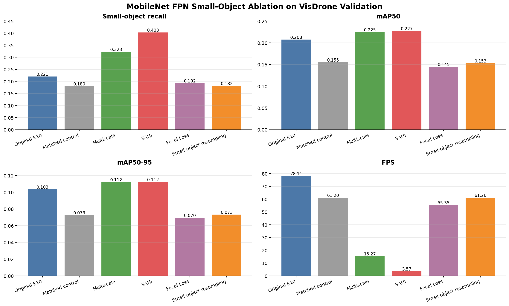
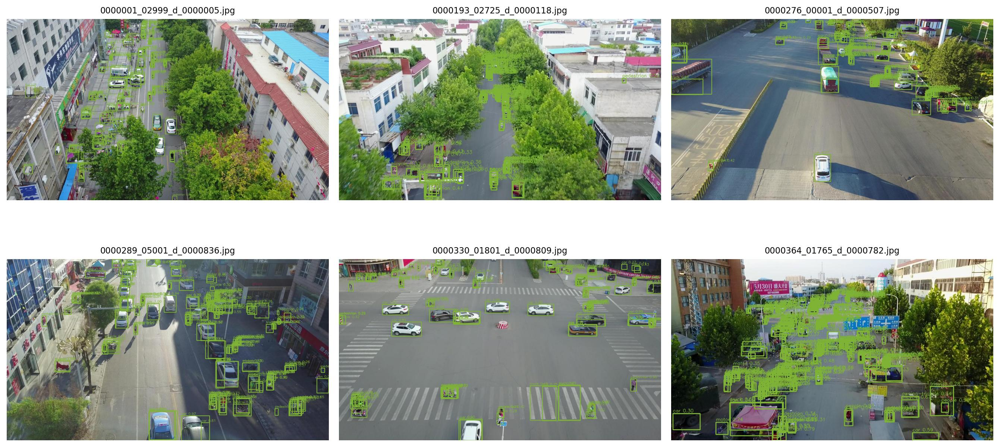
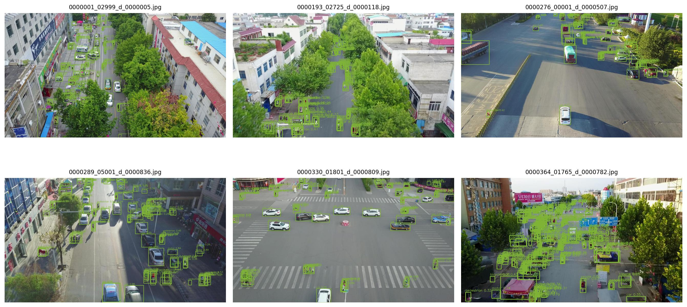
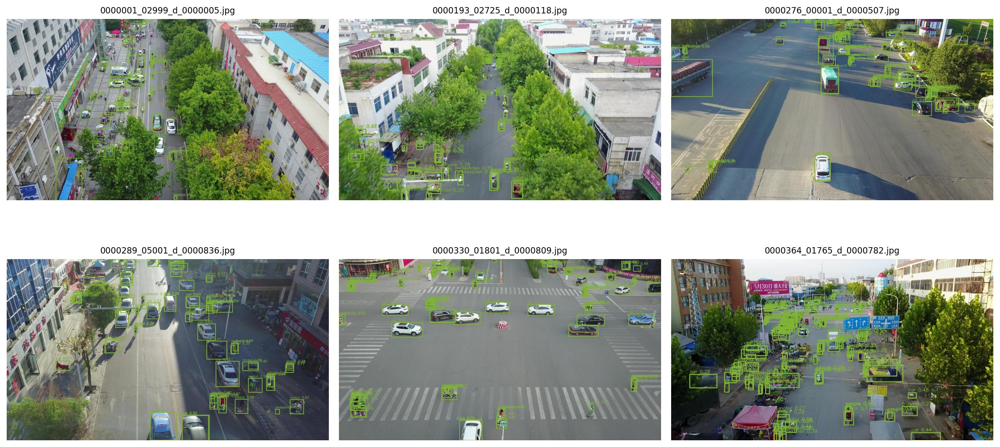
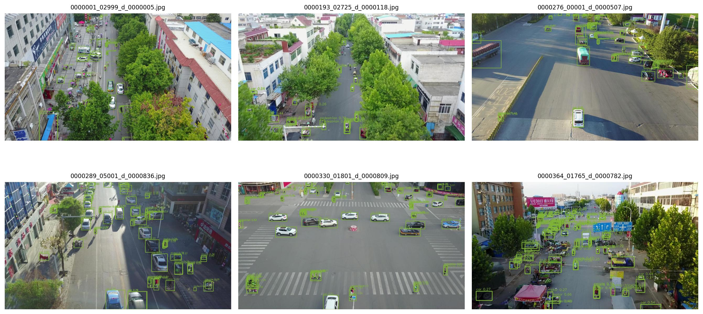

# MobileNet FPN Small-Object Ablation

## Objective

This experiment measures whether four targeted changes improve small-object detection on the VisDrone validation split:

- multiscale inference;
- SAHI sliced inference;
- Focal Loss;
- small-object image resampling.

All reported values were read from completed local runs. No metric was estimated or entered manually.

## Evaluation Protocol

- Model family: Faster R-CNN with a MobileNetV3-Large FPN backbone.
- Validation set: 548 VisDrone DET images containing 38,759 evaluated objects.
- Small object definition: ground-truth area below `32 x 32` pixels.
- Matching: class-aware greedy matching at IoU 0.50 for recall.
- AP: class-averaged AP50 and AP over IoU 0.50:0.95.
- Confidence threshold for recall: 0.25.
- Maximum detections per image: 300.
- Hardware and software: the same local CUDA environment was used for every run.

The original E10 checkpoint was trained with 640-pixel overlapping crops. Focal Loss and resampling were then fine-tuned for six epochs on the same 6,471 full training images at an input range of 640-960. A standard-loss fine-tuning run with identical settings was added as a matched control. This control separates the intervention effect from the distribution change introduced by full-image fine-tuning.

Final metrics for every fine-tuned checkpoint were recomputed at the same 800-1280 inference range. Multiscale and SAHI used the unmodified original E10 checkpoint.

## Configurations

| Run | Changed factor | Key setting |
| --- | --- | --- |
| Original E10 | None | Standard inference at 800-1280 |
| Matched control | Full-image fine-tuning only | Standard loss, six epochs |
| Multiscale | Inference scale | 640-960, 800-1280, and 960-1536; class-aware NMS |
| SAHI | Sliced inference | 512 x 512 slices, 20% overlap, plus full-image prediction |
| Focal Loss | Classification loss | Gamma 2.0, six-epoch fine-tuning |
| Small-object resampling | Training sampler | Image sampling strength 2.0, six-epoch fine-tuning |

## Results

| Method | Small-object recall | mAP50 | mAP50-95 | FPS |
| --- | ---: | ---: | ---: | ---: |
| Original E10 | 0.2205 | 0.2076 | 0.1033 | 78.11 |
| Matched control | 0.1804 | 0.1549 | 0.0726 | 61.20 |
| Multiscale | 0.3229 | 0.2248 | 0.1122 | 15.27 |
| SAHI | **0.4026** | **0.2273** | **0.1125** | 3.57 |
| Focal Loss | 0.1922 | 0.1450 | 0.0695 | 55.35 |
| Small-object resampling | 0.1819 | 0.1528 | 0.0732 | 61.26 |

The machine-readable table is available in [summary.csv](assets/mobilenet_small_object_ablation/summary.csv).



## Findings

### SAHI

SAHI produced the strongest small-object result. Relative to the original E10 baseline, small-object recall increased by 0.1821, mAP50 increased by 0.0197, and mAP50-95 increased by 0.0091. The cost was severe: throughput fell from 78.11 to 3.57 FPS. SAHI is suitable for offline inspection or accuracy-first processing, but this configuration is not appropriate for a real-time onboard path.



### Multiscale inference

Multiscale inference gave the best accuracy-speed compromise among the tested inference strategies. Relative to E10, small-object recall increased by 0.1024, mAP50 by 0.0172, and mAP50-95 by 0.0089. Throughput fell to 15.27 FPS because each image was evaluated at three scales. It remains more than four times faster than the tested SAHI configuration.



### Focal Loss

Against the matched standard fine-tuning control, Focal Loss increased small-object recall by 0.0118 but reduced mAP50 by 0.0099 and mAP50-95 by 0.0031. FPS also fell by 5.85 because the custom ROI classification path adds work. The loss recovered steadily during training, but six epochs were not sufficient to regain the original E10 accuracy. This exact `gamma=2.0` configuration is therefore not selected.



### Small-object resampling

Against the matched control, resampling increased small-object recall by only 0.0016. mAP50 decreased by 0.0021, mAP50-95 increased by 0.0006, and FPS was effectively unchanged. The changes are too small to support an engineering benefit. Image-level sampling is also coarse: an image with many tiny targets can still contain a dominant set of easy objects.



### Matched control

The matched control underperformed the original E10 checkpoint. This is an important result rather than a reporting error. The original checkpoint was trained on 40,055 overlapping crops, while the fine-tuning runs used 6,471 complete images. Removing the crop-heavy training distribution reduced the effective scale and frequency of small targets. Consequently, the original E10 baseline remains the correct deployment starting point.


## Decision

- Use multiscale inference when an approximately 15 FPS accuracy-oriented mode is acceptable.
- Use SAHI only for offline or low-throughput analysis where small-object recall is the priority.
- Keep the original E10 checkpoint for the fastest MobileNet path.
- Do not adopt the tested Focal Loss or image-level resampling settings without a crop-preserving retraining schedule and a wider hyperparameter search.

## Reproduction

Run inference ablations with:

```powershell
D:\Anaconda3\envs\ml-gpu\python.exe scripts\experiments\ablate_mobilenet_small_objects.py --mode multiscale --checkpoint outputs\training\mobilenet_fpn_visdrone_e10_full\weights\best.pt --output outputs\ablation\mobilenet_small_objects\multiscale_640_800_960

D:\Anaconda3\envs\ml-gpu\python.exe scripts\experiments\ablate_mobilenet_small_objects.py --mode sahi --checkpoint outputs\training\mobilenet_fpn_visdrone_e10_full\weights\best.pt --output outputs\ablation\mobilenet_small_objects\sahi_512_overlap020 --slice-height 512 --slice-width 512 --overlap-height-ratio 0.2 --overlap-width-ratio 0.2
```

Generate the result table and chart after all run summaries exist:

```powershell
D:\Anaconda3\envs\ml-gpu\python.exe scripts\experiments\summarize_small_object_ablation.py
```

Raw run summaries are stored under `outputs/ablation/mobilenet_small_objects/`. The tracked report assets are copies of the generated chart, CSV, and prediction grids.
