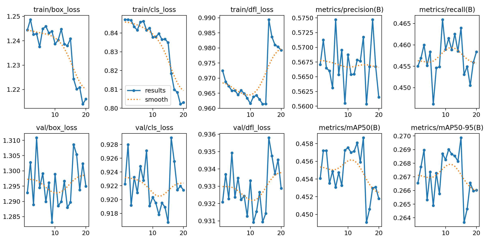
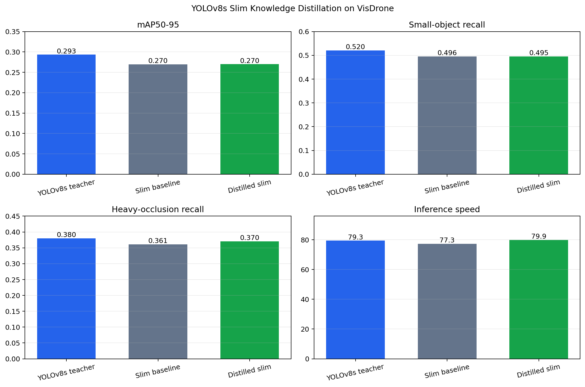
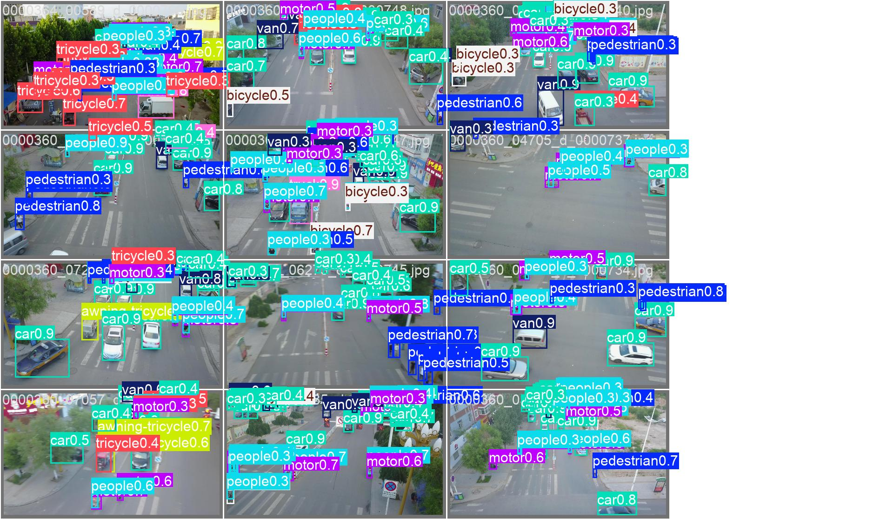
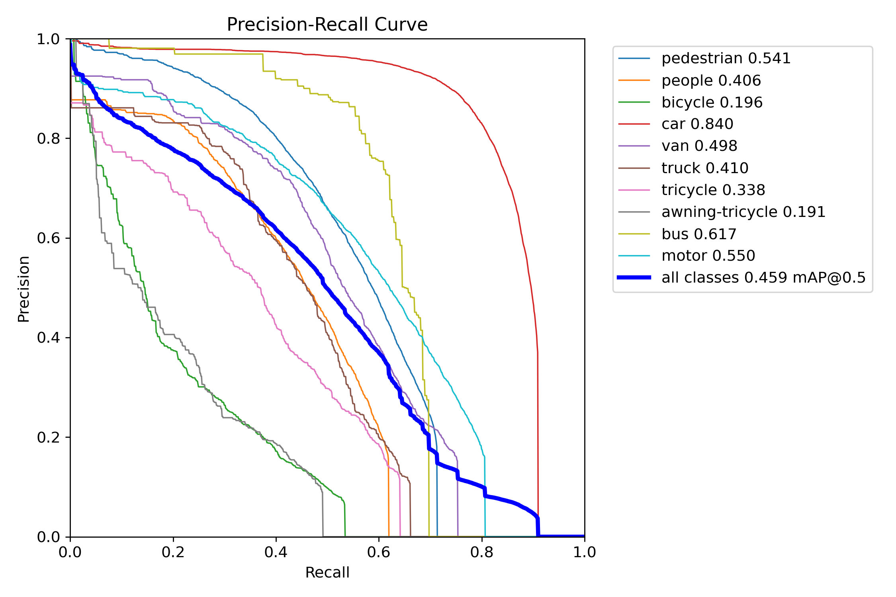

# YOLOv8s Slim Knowledge Distillation

## Objective

This experiment tested whether a full YOLOv8s teacher could recover accuracy lost by the width-0.4375 slim detector, with emphasis on objects smaller than 32 x 32 pixels and heavily occluded objects.

The teacher and student were existing VisDrone checkpoints:

- Teacher: `outputs/training/yolov8s_visdrone_mildaug_e100/weights/best.pt`
- Student initialization: `outputs/training/yolov8s_slim04375_visdrone_e100/weights/best.pt`
- Distilled output: `outputs/training/yolov8s_slim04375_distilled_e20/weights/best.pt`

## Method

The student retained its original architecture. Knowledge distillation was applied only during training, so it adds no layers or teacher dependency at inference time.

For every image, the teacher and student produced aligned predictions at the same three detection scales. The loss used:

- Bernoulli KL divergence between teacher and student class logits.
- KL divergence between the four 16-bin bounding-box distributions.
- The 1,500 anchors with the highest teacher confidence.
- Temperature 2.0.
- Classification distillation weight 0.5.
- Box-distribution distillation weight 0.25.

The normal VisDrone detection loss remained active. Distillation was therefore an auxiliary objective rather than a replacement for ground-truth supervision.

## Training Protocol

| Setting | Value |
|---|---:|
| Training images | 6,471 |
| Validation images | 548 |
| Input size | 960 x 960 |
| Epochs | 20 |
| Batch size | 6 |
| Optimizer | SGD |
| Initial learning rate | 0.001 |
| LR schedule | Cosine |
| Mosaic | Enabled, closed for the final 5 epochs |
| Device | NVIDIA GPU |

The one-epoch smoke test used 1% of the training set. Its 33 batches produced a mean weighted distillation contribution of 0.15673 and verified finite student gradients and standard Ultralytics checkpoint loading.

The full run took 3,004.36 seconds. The best validation checkpoint occurred at epoch 15:

| Precision | Recall | mAP50 | mAP50-95 |
|---:|---:|---:|---:|
| 0.57175 | 0.46396 | 0.45867 | 0.26987 |



## Unified Evaluation

All three models were evaluated on the complete VisDrone validation split at 960 pixels, confidence 0.25, matching IoU 0.5, and 20 warm-up images. FPS was measured again in the same session to avoid comparing different GPU power states.

| Model | Precision | Recall | mAP50 | mAP50-95 | Small recall | Heavy-occlusion recall | FPS |
|---|---:|---:|---:|---:|---:|---:|---:|
| YOLOv8s teacher | 0.59833 | 0.48712 | 0.49166 | 0.29332 | 0.52008 | 0.37962 | 79.34 |
| Slim baseline | 0.57090 | 0.45848 | 0.45821 | 0.26961 | 0.49553 | 0.36113 | 77.28 |
| Distilled slim | 0.57175 | 0.46396 | 0.45867 | 0.26987 | 0.49530 | 0.37021 | 79.86 |



The distilled model changed the slim baseline as follows:

- Recall: +0.00548.
- mAP50: +0.00046.
- mAP50-95: +0.00026.
- Heavy-occlusion recall: +0.00908, recovering 49.09% of the teacher-to-student gap.
- Small-object recall: -0.00023, effectively unchanged and slightly worse.
- Overall recall at IoU 0.5: -0.00029, effectively unchanged.

The FPS variation is measurement noise rather than a structural speed improvement. Baseline and distilled checkpoints use the same slim architecture, and the teacher is not present during deployment.

## Visual Evidence

The prediction image below was generated by validation of the distilled checkpoint. It is not a generated or manually edited illustration.





## Findings

The experiment partially met its objective. Output-distribution distillation improved heavily occluded-object recall and modestly improved standard validation recall, but it did not recover small-object recall. The strongest result is the 49.09% recovery of the heavy-occlusion gap.

The likely limitation is the top-confidence anchor selection. It transfers stable teacher decisions effectively, including partially visible targets, but weak small-object predictions are less likely to enter the top 1,500 anchors. Output-only distillation also does not directly transfer the teacher's higher-resolution P3 feature representation.

For a further small-object-specific iteration, the most defensible changes are ground-truth-masked P3 feature distillation, increased weight for anchors assigned to objects below 32 x 32 pixels, and a separate weight ablation. Those changes should be evaluated against the current run rather than being reported as completed results.

## Reproduction

```powershell
D:\Anaconda3\envs\ml-gpu\python.exe scripts\experiments\train_yolo_distillation.py
D:\Anaconda3\envs\ml-gpu\python.exe scripts\evaluate_detector.py `
  --weights outputs\training\yolov8s_slim04375_distilled_e20\weights\best.pt `
  --training-results outputs\training\yolov8s_slim04375_distilled_e20\results.csv `
  --output outputs\evaluation\yolov8s_slim04375_distilled_e20 `
  --imgsz 960 --conf 0.25 --iou 0.5 --device 0 --warmup 20
D:\Anaconda3\envs\ml-gpu\python.exe scripts\experiments\summarize_yolo_distillation.py
```

The comparison table is also available as `docs/assets/yolo_distillation/summary.csv`. Every plotted value is read from saved evaluation JSON files.
