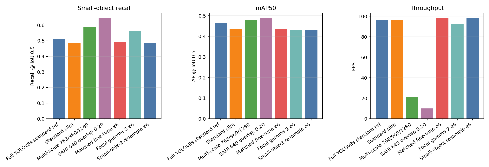
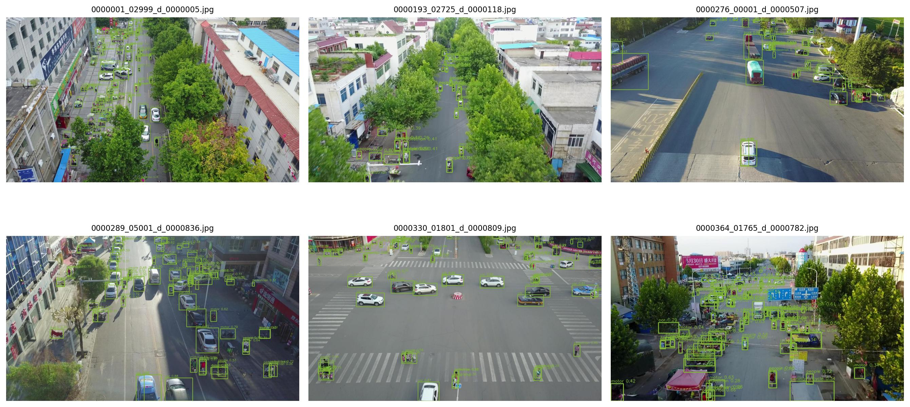
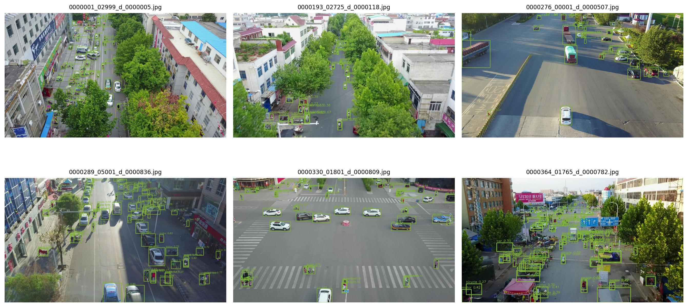
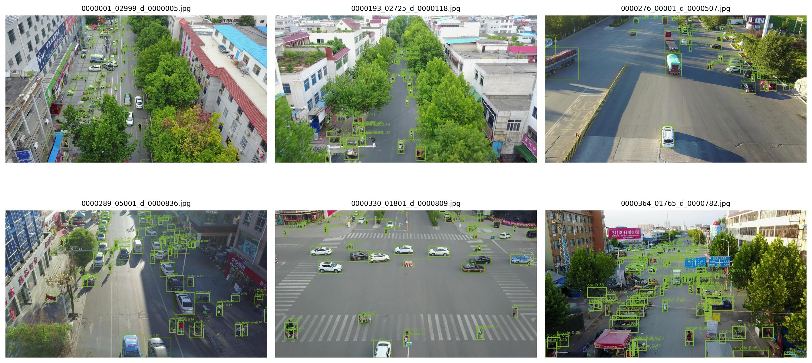
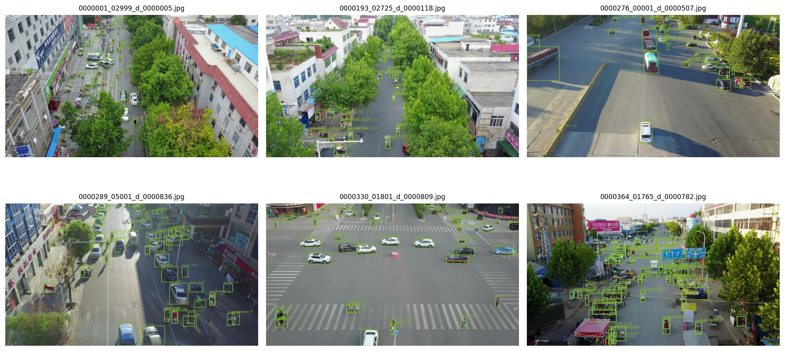

# YOLOv8s Slim Small-Object Ablation

## Objective

This experiment evaluates small-object optimization options for the current `YOLOv8s-slim 0.4375 e100` detector on VisDrone. A full `YOLOv8s e100` standard-inference row is included as an accuracy reference, while the ablation rows focus on the slim deployment candidate.

The tested directions are:

- SAHI-style sliced inference;
- multi-scale inference;
- Focal classification loss;
- small-object image resampling.

All reported values were produced by completed local runs. No metric was estimated manually.

## Evaluation Protocol

- Validation set: 548 VisDrone DET images with 38,759 evaluated objects.
- Slim checkpoint: `outputs/training/yolov8s_slim04375_visdrone_e100/weights/best.pt`.
- Full YOLO reference checkpoint: `outputs/training/yolov8s_visdrone_mildaug_e100/weights/best.pt`.
- Inference input size for standard runs: 960.
- Small object definition: ground-truth width and height both below 32 pixels.
- Matching: class-aware greedy matching at IoU 0.50.
- Recall confidence threshold: 0.25.
- AP score threshold: 0.01.
- Maximum detections per image: 300.
- Hardware and software: the same local CUDA environment was used for all runs.

The training-side ablations were fine-tuned for six epochs from the same slim checkpoint. A standard-loss fine-tuning run with identical hyperparameters was added as a matched control, so the Focal Loss and resampling effects are compared against the same extra-training budget.

## Configurations

| Run | Changed factor | Key setting |
| --- | --- | --- |
| Full YOLOv8s reference | Model capacity | Standard 960 inference |
| Standard slim | None | YOLOv8s-slim 0.4375 e100, standard 960 inference |
| Multi-scale | Inference scale | 768, 960, and 1280; class-aware NMS |
| SAHI | Sliced inference | 640 x 640 slices, 20% overlap, plus full-image prediction |
| Matched fine-tune | Extra training only | Standard loss, six epochs |
| Focal Loss | Classification loss | Gamma 2.0, six-epoch fine-tuning |
| Small-object resampling | Training sampler | Image sampling strength 2.0, six-epoch fine-tuning |

## Results

| Method | Small recall | Delta vs slim | Heavy occlusion recall | Precision | Recall | mAP50 | mAP50-95 | FPS |
| --- | ---: | ---: | ---: | ---: | ---: | ---: | ---: | ---: |
| Full YOLOv8s standard ref | 0.5118 | +0.0249 | 0.3785 | 0.7188 | 0.6118 | 0.4655 | 0.2725 | 96.08 |
| Standard slim | 0.4868 | +0.0000 | 0.3558 | 0.7111 | 0.5893 | 0.4350 | 0.2444 | 96.23 |
| Multi-scale 768/960/1280 | 0.5907 | +0.1039 | 0.4579 | 0.6227 | 0.6746 | 0.4786 | 0.2766 | 20.98 |
| SAHI 640 overlap 0.20 | **0.6456** | **+0.1588** | **0.4831** | 0.5750 | **0.7106** | **0.4888** | 0.2723 | 10.04 |
| Matched fine-tune e6 | 0.4932 | +0.0064 | 0.3577 | 0.7035 | 0.5931 | 0.4335 | 0.2447 | 98.27 |
| Focal gamma 2 e6 | 0.5615 | +0.0747 | 0.4355 | 0.5672 | 0.6505 | 0.4304 | 0.2435 | 92.47 |
| Small-object resample e6 | 0.4861 | -0.0007 | 0.3577 | 0.7080 | 0.5877 | 0.4300 | 0.2410 | 98.28 |

The machine-readable table is available in [summary.csv](assets/yolo_small_object_ablation/summary.csv).



## Findings

### SAHI

SAHI gives the largest small-object recall gain. Compared with standard slim inference, small-object recall increases from 0.4868 to 0.6456, a gain of 0.1588. Heavy-occlusion recall also increases from 0.3558 to 0.4831. The cost is speed: FPS drops from 96.23 to 10.04, and precision drops from 0.7111 to 0.5750 because sliced inference produces more candidate boxes. This is the best offline or accuracy-first option, but it is too expensive for the fastest real-time path.



### Multi-Scale Inference

Multi-scale inference is the best balanced option. It improves small-object recall to 0.5907, mAP50 to 0.4786, and mAP50-95 to 0.2766. It is less aggressive than SAHI but still gives a clear small-object gain of 0.1039 over the slim baseline, while keeping 20.98 FPS. If the deployment budget can accept around 20 FPS, this should be the first optimization to keep.



### Focal Loss

Focal Loss improves recall-oriented metrics but hurts precision and does not improve AP. Compared with the matched fine-tuning control, small-object recall increases from 0.4932 to 0.5615 and heavy-occlusion recall increases from 0.3577 to 0.4355. However, precision drops from 0.7035 to 0.5672, mAP50 decreases from 0.4335 to 0.4304, and mAP50-95 decreases from 0.2447 to 0.2435. This means the current `gamma=2.0` setting finds more small objects, but introduces too many extra false positives to be selected directly.



### Small-Object Resampling

Image-level small-object resampling does not help in this setup. Compared with standard slim inference, small-object recall changes from 0.4868 to 0.4861. Compared with the matched fine-tuning control, it is also lower: 0.4861 versus 0.4932. The likely reason is that image-level oversampling is too coarse for dense VisDrone scenes; duplicating an image with many tiny objects also duplicates its easy medium objects and background clutter.


### Full YOLOv8s Reference

The full YOLOv8s standard row remains a useful upper-capacity reference. It improves small-object recall over standard slim by 0.0249 and mAP50-95 by 0.0281, but the improvement is smaller than the gain from slim multi-scale or slim SAHI inference. For this validation split, changing the inference strategy is more effective for tiny objects than simply moving from slim to full YOLOv8s under standard inference.



## Decision

- Priority 1: keep multi-scale inference as the practical small-object optimization path when around 20 FPS is acceptable.
- Priority 2: keep SAHI for offline review, high-altitude dense scenes, or accuracy-first analysis where 10 FPS is acceptable.
- Priority 3: use Focal Loss only if the next iteration adds threshold tuning, class-wise confidence calibration, or a lower-gamma search, because the current run trades too much precision for recall.
- Do not continue the tested image-level small-object resampling route as-is.
- For real-time deployment, keep standard slim or TensorRT FP16 standard inference as the speed-first path, and expose multi-scale as an accuracy mode if product constraints allow it.

## Reproduction

Run inference ablations with:

```powershell
D:\Anaconda3\envs\ml-gpu\python.exe scripts\experiments\ablate_yolo_small_objects.py --mode standard --weights outputs\training\yolov8s_slim04375_visdrone_e100\weights\best.pt --output outputs\ablation\yolo_slim_small_objects\standard --warmup 20

D:\Anaconda3\envs\ml-gpu\python.exe scripts\experiments\ablate_yolo_small_objects.py --mode multiscale --weights outputs\training\yolov8s_slim04375_visdrone_e100\weights\best.pt --output outputs\ablation\yolo_slim_small_objects\multiscale_768_960_1280 --warmup 20 --scales 768,960,1280

D:\Anaconda3\envs\ml-gpu\python.exe scripts\experiments\ablate_yolo_small_objects.py --mode sahi --weights outputs\training\yolov8s_slim04375_visdrone_e100\weights\best.pt --output outputs\ablation\yolo_slim_small_objects\sahi_640_overlap020 --warmup 20 --slice-size 640 --slice-overlap 0.2 --sahi-standard-prediction
```

Run training ablations with:

```powershell
D:\Anaconda3\envs\ml-gpu\python.exe scripts\experiments\train_yolo_small_object_ablation.py --name yolo_slim_control_finetune_e6 --epochs 6 --batch 8 --workers 4 --patience 10

D:\Anaconda3\envs\ml-gpu\python.exe scripts\experiments\train_yolo_small_object_ablation.py --name yolo_slim_focal_gamma2_e6 --epochs 6 --batch 8 --workers 4 --patience 10 --focal-gamma 2.0

D:\Anaconda3\envs\ml-gpu\python.exe scripts\experiments\train_yolo_small_object_ablation.py --name yolo_slim_small_resample_strength2_e6 --epochs 6 --batch 8 --workers 4 --patience 10 --small-object-resample-strength 2.0
```

Generate the result table and chart after all run summaries exist:

```powershell
D:\Anaconda3\envs\ml-gpu\python.exe scripts\experiments\summarize_yolo_small_object_ablation.py
```

Raw outputs are stored under `outputs/ablation/yolo_slim_small_objects/`.
