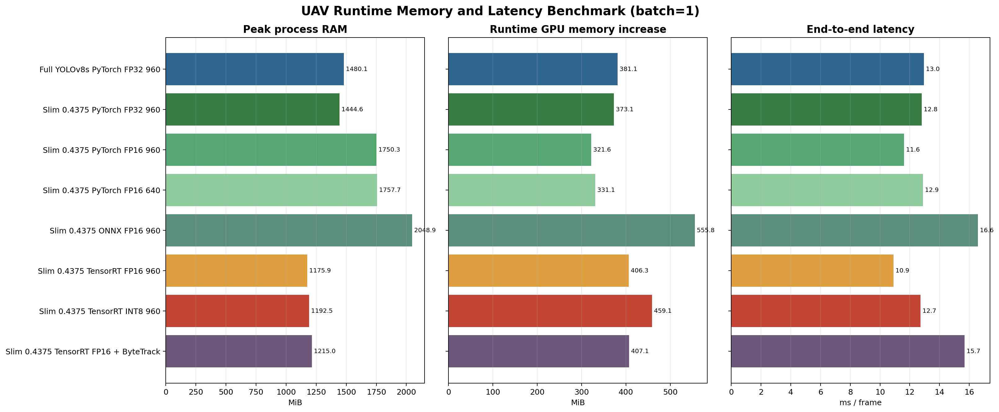

# UAV Runtime Memory Benchmark

## Goal

Model parameters and checkpoint size only describe storage cost. They do not directly represent runtime RAM, GPU memory, framework overhead, activation buffers, post-processing, or tracking state. This benchmark adds isolated-process runtime memory measurements for the current UAV detection deployment candidates.

The study answers four deployment questions:

- Does the `0.4375` slim model reduce runtime memory in proportion to its smaller checkpoint?
- Which deployment backend has the lowest host-memory pressure?
- Does the current INT8 engine provide a memory advantage over TensorRT FP16?
- How much additional memory and latency does ByteTrack add?

## Protocol

- Hardware: NVIDIA GeForce RTX 5080 Laptop GPU with 16,303 MiB VRAM and 31.37 GiB system RAM.
- Batch size: `1`.
- Warm-up: `10` frames.
- Measurement: `50` VisDrone validation frames.
- Default input size: `960`, with one `640` input-size control.
- Isolation: every scenario runs in a new Python process.
- RAM: peak resident set size (RSS), sampled every `50 ms`.
- GPU memory: NVML per-process memory where available.
- Windows fallback: WDDM did not expose reliable per-process GPU memory, so the reported GPU value is the change in total device memory between the isolated-process baseline and runtime peak.
- PyTorch supplement: CUDA allocator peak allocated and reserved memory is recorded directly.
- Latency: end-to-end Ultralytics `predict` or `track` call, excluding disk image loading.

The benchmark is reproducible with:

```powershell
& "D:\Anaconda3\envs\ml-gpu\python.exe" scripts/benchmark_runtime_memory.py --warmup 10 --iterations 50
```

## Results

| Configuration | Artifact | Peak RAM | RAM increase | GPU increase | Torch allocated | Latency | FPS |
| --- | ---: | ---: | ---: | ---: | ---: | ---: | ---: |
| Full YOLOv8s, PyTorch FP32, 960 | 21.51 MiB | 1480.1 MiB | 882.1 MiB | 381.1 MiB | 89.1 MiB | 13.0 ms | 77.2 |
| Slim 0.4375, PyTorch FP32, 960 | 16.70 MiB | 1444.6 MiB | 845.6 MiB | 373.1 MiB | 84.8 MiB | 12.8 ms | 78.1 |
| Slim 0.4375, PyTorch FP16, 960 | 16.70 MiB | 1750.3 MiB | 1151.7 MiB | 321.6 MiB | 42.4 MiB | 11.6 ms | 86.1 |
| Slim 0.4375, PyTorch FP16, 640 | 16.70 MiB | 1757.7 MiB | 1159.0 MiB | 331.1 MiB | 43.3 MiB | 12.9 ms | 77.6 |
| Slim 0.4375, ONNX FP16, 960 | 16.65 MiB | 2048.9 MiB | 1450.6 MiB | 555.8 MiB | 8.4 MiB | 16.6 ms | 60.3 |
| Slim 0.4375, TensorRT FP16, 960 | 21.69 MiB | **1175.9 MiB** | **572.0 MiB** | 406.3 MiB | 25.2 MiB | **10.9 ms** | **91.7** |
| Slim 0.4375, TensorRT INT8, 960 | 66.02 MiB | 1192.5 MiB | 587.5 MiB | 459.1 MiB | 25.2 MiB | 12.7 ms | 78.6 |
| Slim 0.4375, TensorRT FP16 + ByteTrack | 21.69 MiB | 1215.0 MiB | 610.7 MiB | 407.1 MiB | 25.2 MiB | 15.7 ms | 63.8 |



## Findings

### Slimming reduces storage more than runtime memory

The slim checkpoint is `22.4%` smaller than the full YOLOv8s checkpoint, but under the same PyTorch FP32 and `960` setup:

- Peak process RAM decreases by only `35.5 MiB`, or `2.4%`.
- Runtime RAM increase decreases by `36.5 MiB`, or `4.1%`.
- GPU-memory increase decreases by about `8.0 MiB`, or `2.1%`.
- PyTorch peak allocated memory decreases by `4.3 MiB`, or `4.8%`.

The runtime reduction is much smaller than the checkpoint reduction because framework libraries, CUDA context, image buffers, intermediate activations, NMS, and Python runtime overhead are shared fixed costs.

### TensorRT FP16 is the best current deployment backend

TensorRT FP16 has the lowest measured peak process RAM and the best end-to-end latency:

- `1175.9 MiB` peak process RAM.
- `572.0 MiB` RAM increase above the isolated Python framework baseline.
- `10.9 ms` per frame and `91.7 FPS`.

Compared with ONNX FP16, TensorRT FP16 reduces peak process RAM by `873.0 MiB` (`42.6%`), reduces the measured GPU-memory increase by `149.5 MiB` (`26.9%`), and lowers latency by `34.2%`.

### INT8 does not provide a memory advantage

The current INT8 engine is not smaller or more memory-efficient than TensorRT FP16:

- Engine file: `66.02 MiB` versus `21.69 MiB`.
- Peak RAM: `1192.5 MiB` versus `1175.9 MiB`.
- GPU-memory increase: `459.1 MiB` versus `406.3 MiB`.
- Latency: `12.7 ms` versus `10.9 ms`.

Together with the previously measured accuracy loss, this confirms that the current INT8 route should not be used as the default edge deployment configuration.

### ByteTrack adds moderate RAM but meaningful latency

Adding ByteTrack to TensorRT FP16 increases:

- Peak process RAM by `39.1 MiB` (`3.3%`).
- Runtime RAM increase by `38.7 MiB` (`6.8%`).
- Mean latency by `4.8 ms` (`43.8%`).

GPU-memory change is negligible because ByteTrack is mainly CPU-side association and state management. Tracking remains deployable, but the target device must be evaluated for CPU performance as well as GPU/NPU capacity.

### FP16 and lower input resolution must be validated on the target device

PyTorch FP16 halves the direct CUDA allocator peak from `84.8 MiB` to `42.4 MiB`, but the current Python pipeline shows higher host RSS after FP16 backend initialization. This is a framework/runtime behavior on the test laptop, not a general conclusion that FP16 requires more edge memory.

The `640` control also did not reduce the measured peak on this high-end laptop. Fixed framework and model costs dominate this test, and GPU-kernel scheduling differs from an embedded device. Input-size benefits should therefore be remeasured on the actual target platform.

## Edge Deployment Recommendation

For the current implementation:

1. Use the slim `0.4375` model with TensorRT FP16 as the default deployment route.
2. Budget at least `1.2 GiB` process RAM for detection and approximately `1.25 GiB` for detection plus ByteTrack in the current Python pipeline, before adding video decoding, application UI, message queues, or other services.
3. Do not select the current INT8 engine for memory reasons; it is larger, slower, and less accurate than FP16.
4. For a strict-memory device, move from the Python/Ultralytics wrapper to a minimal C++ TensorRT runtime because approximately `600 MiB` of the measured baseline is Python/framework overhead.
5. Repeat the benchmark on the real edge device. Jetson-class devices use unified memory, so laptop RAM and discrete VRAM values cannot be added directly or transferred as an absolute constraint.

On NVIDIA Jetson hardware, the final acceptance test should collect `tegrastats` or `jtop` data for:

- idle application memory;
- model-load peak;
- steady detection peak;
- detection plus tracking peak;
- video decode plus inference peak;
- thermal-throttled sustained FPS.

## Outputs

- `outputs/deployment/runtime_memory_benchmark/summary.json`
- `outputs/deployment/runtime_memory_benchmark/summary.csv`
- `outputs/deployment/runtime_memory_benchmark/runtime_memory_benchmark.png`
- `docs/assets/runtime_memory_benchmark/summary.json`
- `docs/assets/runtime_memory_benchmark/summary.csv`
- `docs/assets/runtime_memory_benchmark/runtime_memory_benchmark.png`

